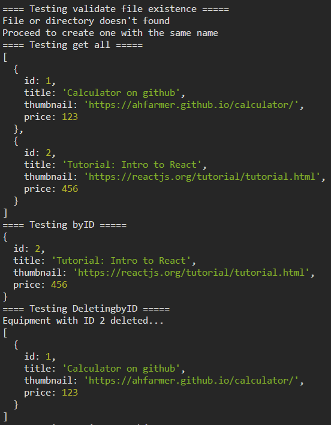
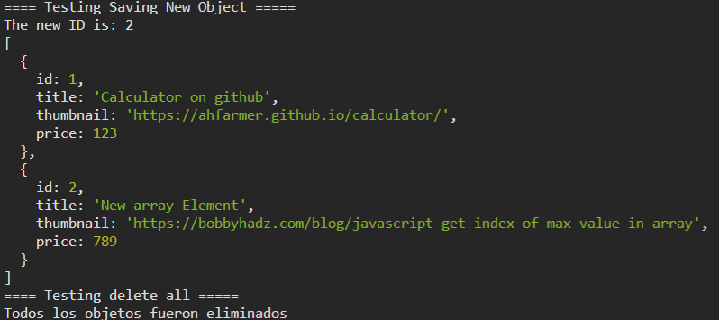

Martín Reyes Jesús Iván
30-May-2022
Backend

# Desafío 2 | Instrucciones

El presente contenido es para resolver el desafío 2

`Desafío 2`:

Implementar programa que contenga una clase llamada Contenedor que reciba el nombre del archivo con el que va a trabajar e implemente los siguientes métodos:

* save(Object): Number - Recibe un objeto, lo guarda en el archivo, devuelve el id asignado.
* getById(Number): Object - Recibe un id y devuelve el objeto con ese id, o null si no está.
* getAll(): Object[] - Devuelve un array con los objetos presentes en el archivo.
* deleteById(Number): void - Elimina del archivo el objeto con el id buscado.
* deleteAll(): void - Elimina todos los objetos presentes en el archivo.

## Consideraciones

1. El presente código al ejecutarlo va a crear una carpeta temporal llamada `temp` en el disco local C, el cual almacenará el archivo a procesar. Inicialmente lo crea desde cero y finalmente termina dejando un array vacío en el archivo creado como se muestra en las siguientes imágenes

### Result Images

